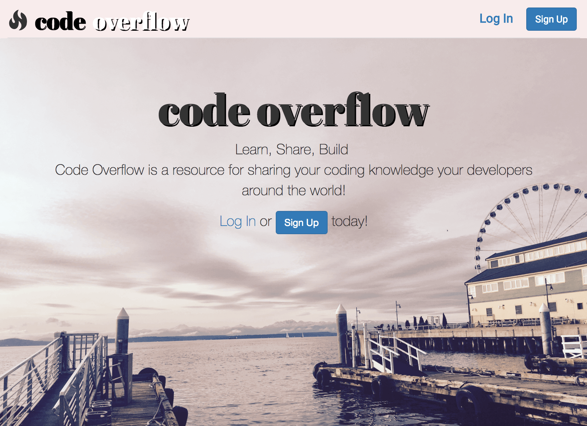

## Code Overflow
Replica version of Stack Overflow that allows users to collaborate on community sourced posts

The app is deployed on Heroku: https://blooming-anchorage-55099.herokuapp.com/
The source code is here on GitHub: https://github.com/summerlove91/coding-wiki
This app was created as Backend project of the [Bloc](www.bloc.io) Full Stack Web Development course.

## User Stories
- As a user, I want to sign up for a free account by providing a user name, password and email
- As a user, I want to sign in and out of Code Overflow
- As a user with a standard account, I want to create, read, update, and delete public questions
- As a developer, I want to offer three user roles: admin, standard, or premium
- As a developer, I want to seed the development database automatically with users and questions
- As a user, I want to upgrade my account from a free to a paid plan
- As a premium user, I want to create private questions
- As a user, I want to edit questions using Markdown syntax
- As a premium user, I want to add and remove collaborators for my private questions

## Setup and Configuration ##
**Languages and Frameworks**: Ruby on Rails and Bootstrap

**Ruby version 2.4.0**

**Database: SQLite (Test, Development), PostgreSQL (Production)**

**Development Tools and Gems include**
+ Devise for authentication
+ Pundit gem for authorization
+ Faker gem
+ Stripe gem to charge for premium users
+ Redcarpet for Markdown rendering gem

**To run Code Overflow locally:**
+ Clone the repository
+ Run bundle install
+ Create and migrate the SQLite database with `rake db:create` and `rake db:migrate`
+ Start the server using `rails server`
+ Run the app on `localhost:3000
